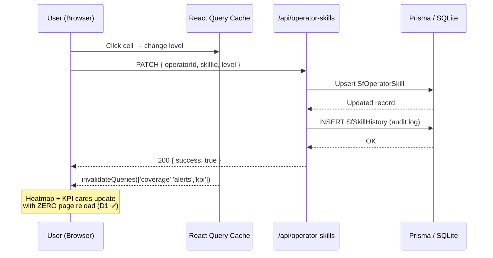
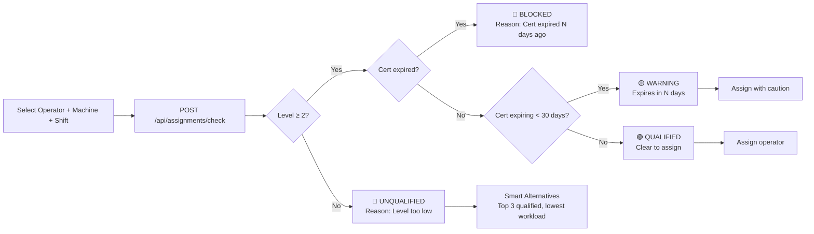
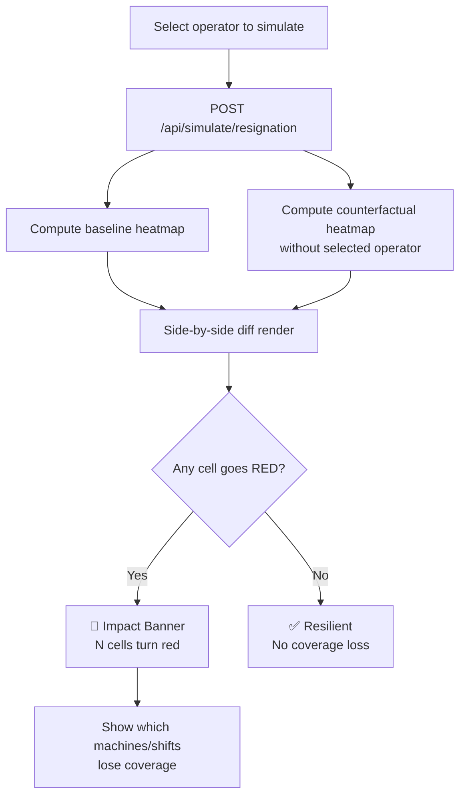
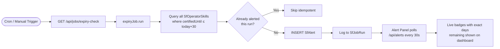
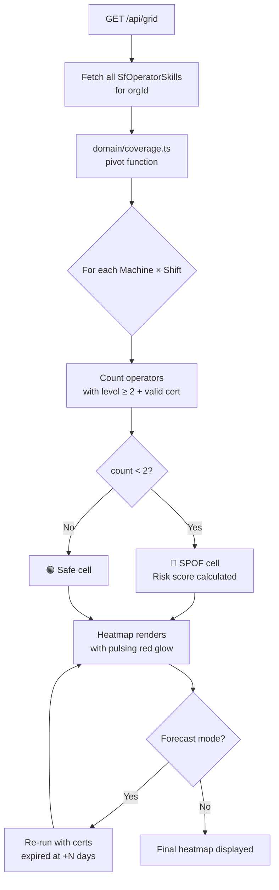
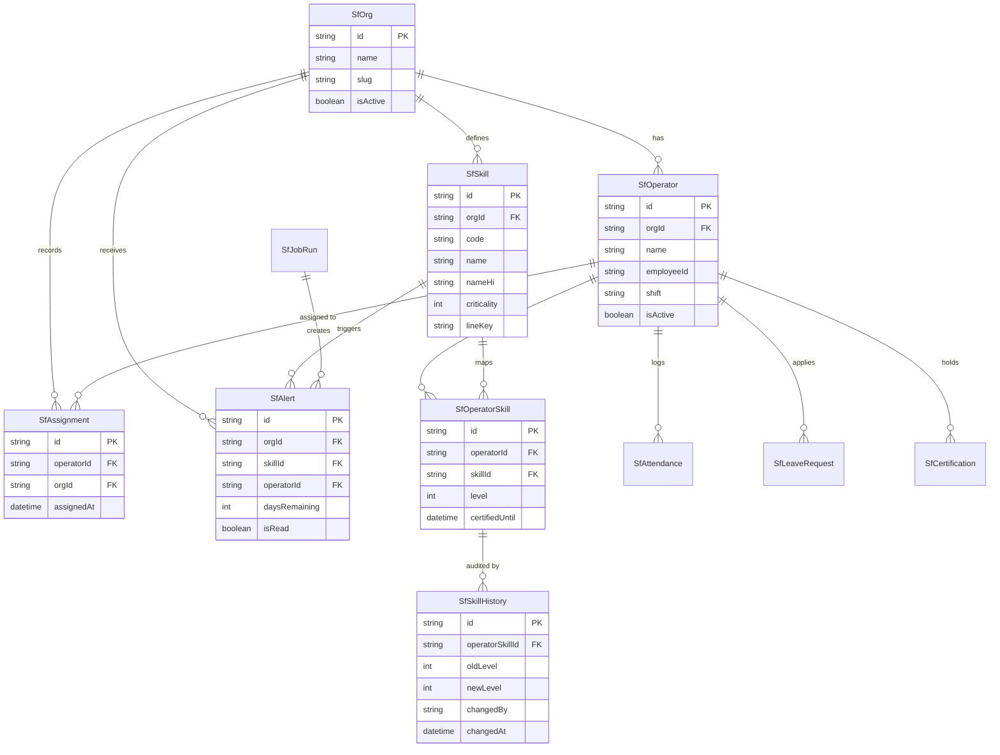

<div align="center">


# SkillsForge

### 🏭 Real-Time Operator Skill Matrix & Certification Tracker

**Manufacturing-grade workforce intelligence — bilingual, zero-downtime, production-ready.**

[](https://nextjs.org/)
[](https://www.typescriptlang.org/)
[](https://www.prisma.io/)
[](https://next-auth.js.org/)
[](https://tanstack.com/query)
[](https://tailwindcss.com/)
[](./LICENSE)

---

*On modern shop floors, **"who can operate which machine"** lives in supervisors' heads or scattered spreadsheets — until a resignation, certification expiry, or regulatory audit hits.*

**SkillsForge eliminates that problem entirely.**

</div>

---

## 📋 Table of Contents

1. [✨ Features at a Glance](#-features-at-a-glance)
2. [🏗️ Architecture](#️-architecture)
3. [🔄 Application Flows](#-application-flows)
4. [🗄️ Database Schema](#️-database-schema)
5. [🚀 Quick Start](#-quick-start)
6. [👤 Demo Users & Roles](#-demo-users--roles)
7. [📡 API Reference](#-api-reference)
8. [📁 Project Structure](#-project-structure)
9. [🧪 Testing](#-testing)
10. [🌐 Internationalization](#-internationalization)
11. [🔒 Security](#-security)
12. [📊 Requirement Traceability](#-requirement-traceability)
13. [🤝 Contributing](#-contributing)

---

## ✨ Features at a Glance

| Feature | Description | Route |
|---------|-------------|-------|
| 📊 **Skill Grid** | 0–4 proficiency matrix with inline edit, history audit | `/grid` |
| 🔥 **Coverage Heatmap** | Shifts × Machines pivot; SPOF cells pulse red | `/` |
| 🚨 **Live Alert Panel** | Certs expiring in 30-day window with exact countdowns | `/` |
| ✅ **Assignment Checker** | Green/Red verdict + smart qualified alternatives | `/assign` |
| 🧑‍💼 **Member Portal** | Self-service attendance, leaves, certifications | `/portal` |
| 📅 **Attendance & Leaves** | Admin view of daily records with approval flow | `/attendance`, `/leaves` |
| 🎭 **Resignation Simulator** | "What if X leaves?" — before/after heatmap comparison | `/simulator` |
| 📈 **Coverage Forecast** | +0 to +90 day slider with expiry lookahead | `/` |
| ⚖️ **Workload Fairness** | 14-day deployment distribution chart + overload detection | `/workload` |
| 📄 **Gap Report + CSV** | Ranked SPOF machines, printable + exportable | `/reports/gaps` |
| 📜 **Verdict Certificate** | Printable assignment qualification proof | `/reports/verdict` |
| 🌐 **Bilingual (EN/HI)** | 100% key parity, Devanagari fonts, cookie persistence | All pages |
| 🛡️ **Super Admin Panel** | Org management, user provisioning | `/superadmin` |

---

## 🏗️ Architecture

```
┌─────────────────────────────────────────────────────────────────┐
│                         SkillsForge Monorepo                    │
│                        (Turborepo + npm ws)                     │
├─────────────────┬───────────────────────────────────────────────┤
│   apps/         │   packages/                                   │
│  skillsforge/   │  (future shared libs)                         │
│  ┌───────────┐  │                                               │
│  │ Next.js 14│  │   shims/quikit/                               │
│  │ App Router│  │   ├── auth/      ← NextAuth shim              │
│  │           │  │   ├── database/  ← Prisma shim                │
│  │ ┌───────┐ │  │   ├── ui/        ← Design system shim         │
│  │ │Server │ │  │   └── redis/     ← In-memory cache shim       │
│  │ │Comps  │ │  │                                               │
│  │ └───────┘ │  │                                               │
│  │ ┌───────┐ │  │                                               │
│  │ │Client │ │  │                                               │
│  │ │Comps  │ │  │                                               │
│  │ └───────┘ │  │                                               │
│  │ ┌───────┐ │  │                                               │
│  │ │Route  │ │  │                                               │
│  │ │Handler│ │  │                                               │
│  │ └───────┘ │  │                                               │
│  └───────────┘  │                                               │
└─────────────────┴───────────────────────────────────────────────┘
```

### Tech Stack

| Layer | Technology | Version |
|-------|-----------|---------|
| **Framework** | Next.js App Router | 14.0.4 |
| **Language** | TypeScript Strict | 5.3 |
| **Database ORM** | Prisma | 5.7 |
| **Database** | SQLite (dev) / PostgreSQL (prod) | — |
| **Authentication** | NextAuth.js JWT | 4.24 |
| **Server State** | TanStack React Query | v5 |
| **Styling** | Tailwind CSS | 3.4 |
| **Validation** | Zod | 3.22 |
| **Charts** | Recharts | 2.10 |
| **Icons** | Lucide React | latest |
| **i18n** | Custom zero-dependency | — |
| **Testing** | Jest + Testing Library | — |
| **Monorepo** | Turborepo | 2.0 |

---

## 🔄 Application Flows

### 1. Authentication & Role-Based Routing

```mermaid
flowchart TD
    A([User visits app]) --> B{Session exists?}
    B -- No --> C[/login page/]
    C --> D{Click persona}
    D --> E[NextAuth signIn]
    E --> F[JWT issued with role]
    F --> G{Role check}
    B -- Yes --> G
    G -- SUPER_ADMIN --> H[/superadmin/]
    G -- ORG_ADMIN --> I[/admin/ Dashboard]
    G -- APP_ADMIN --> I
    G -- MEMBER --> J[/portal/ Member Panel]
    G -- No role --> C
```

---

### 2. Skill Grid Live Edit Flow (Demo Gate D1)



---

### 3. Assignment Qualification Check Flow (Demo Gate D3)



---

### 4. Resignation Simulator Flow (MVP-1)



---

### 5. Certification Expiry Alert Pipeline (Demo Gate D2)



---

### 6. Coverage Heatmap Computation



---

### 7. Member Portal Self-Service Flow

```mermaid
flowchart LR
    M([Member logs in]) --> P[/portal/ Dashboard]
    P --> A[View own skill levels]
    P --> B[Mark attendance\nPOST /api/member/attendance]
    P --> C[Apply for leave\nPOST /api/member/leaves]
    P --> D[Upload certification\nPOST /api/member/certifications]
    B --> E[Admin sees record\nat /attendance]
    C --> F[Admin approves/rejects\nat /leaves]
    D --> G[Admin verifies cert\nExpiry tracked in SfAlert]
```

---

## 🗄️ Database Schema



---

## 🚀 Quick Start

### Prerequisites

- **Node.js** 20+ (LTS)
- **npm** 10+

```bash
# 1. Clone the repository
git clone https://github.com/priyanshujaiswal17/skillsforge.git
cd skillsforge

# 2. Install all dependencies (monorepo root)
npm install

# 3. Set up environment variables
cp apps/skillsforge/.env.example apps/skillsforge/.env.local

# 4. Push the Prisma schema & seed demo data
cd apps/skillsforge
npx prisma db push
cd ../..

# 5. Start the development server on port 3011
npm run dev
```

**App is live at:** [http://localhost:3011](http://localhost:3011)

### Environment Variables

```env
# apps/skillsforge/.env.local

# Database (SQLite for dev, PostgreSQL for prod)
DATABASE_URL="file:./dev.db"

# NextAuth
NEXTAUTH_SECRET="your-super-secret-key-here"
NEXTAUTH_URL="http://localhost:3011"
```

---

## 👤 Demo Users & Roles

The app ships with pre-seeded personas — **no registration required**.

| Persona | Name | Role | Access |
|---------|------|------|--------|
| 🏭 **Plant Head** | Vikram Singh | `ORG_ADMIN` | Full admin: grid, alerts, reports, user management |
| 👩‍💼 **Shop Supervisor** | Anita Sharma | `APP_ADMIN` | Grid edits, assignment checks, gap reports |
| 🔍 **Quality Auditor** | Rohit Kulkarni | `MEMBER` | Member portal: attendance, leaves, certifications |
| 🔑 **Super Admin** | System | `SUPER_ADMIN` | Multi-org management, user provisioning |

Click any persona card on the `/login` page — no password required in demo mode.

---

## 📡 API Reference

### Core Endpoints

| Method | Endpoint | Auth | Description |
|--------|----------|------|-------------|
| `GET` | `/api/grid` | `APP_ADMIN+` | Full skill matrix for org |
| `PATCH` | `/api/operator-skills` | `APP_ADMIN+` | Update operator skill level |
| `GET` | `/api/alerts` | `APP_ADMIN+` | Active certification alerts |
| `GET` | `/api/reports/gaps` | `APP_ADMIN+` | SPOF gap report |
| `POST` | `/api/assignments/check` | `APP_ADMIN+` | Qualification verdict |
| `GET` | `/api/assignments` | `APP_ADMIN+` | Assignment history |
| `POST` | `/api/simulate/resignation` | `APP_ADMIN+` | Resignation impact simulation |
| `POST` | `/api/simulate/forecast` | `APP_ADMIN+` | +N day coverage forecast |
| `GET` | `/api/jobs/expiry-check` | `APP_ADMIN+` | Trigger expiry check job |
| `GET` | `/api/history` | `APP_ADMIN+` | Skill change audit history |
| `GET` | `/api/skills` | `APP_ADMIN+` | List all skills/machines |
| `GET` | `/api/operators` | `APP_ADMIN+` | List all operators |
| `GET` | `/api/audit-log` | `ORG_ADMIN+` | Full audit log |

### Member Endpoints

| Method | Endpoint | Auth | Description |
|--------|----------|------|-------------|
| `GET` | `/api/member/dashboard` | `MEMBER+` | Personal skill summary |
| `POST` | `/api/member/attendance` | `MEMBER+` | Mark own attendance |
| `GET/POST` | `/api/member/leaves` | `MEMBER+` | Leave requests |
| `POST` | `/api/member/certifications` | `MEMBER+` | Upload certification |

### Admin Endpoints

| Method | Endpoint | Auth | Description |
|--------|----------|------|-------------|
| `GET/POST/PATCH` | `/api/admin/leaves` | `ORG_ADMIN+` | Manage all leave requests |
| `GET/POST` | `/api/admin/attendance` | `ORG_ADMIN+` | Attendance management |
| `GET/POST` | `/api/shifts` | `ORG_ADMIN+` | Shift configuration |

### Super Admin Endpoints

| Method | Endpoint | Auth | Description |
|--------|----------|------|-------------|
| `GET/POST` | `/api/superadmin/orgs` | `SUPER_ADMIN` | Organization management |
| `GET/POST/DELETE` | `/api/superadmin/users` | `SUPER_ADMIN` | User provisioning |

---

## 📁 Project Structure

```
skillsforge/                          # Monorepo root
├── apps/
│   └── skillsforge/                  # Main Next.js application
│       ├── app/
│       │   ├── (dashboard)/          # Protected dashboard routes
│       │   │   ├── page.tsx          # Dashboard + Heatmap + KPI
│       │   │   ├── grid/             # Skill Grid (C1)
│       │   │   ├── assign/           # Assignment Checker (C4)
│       │   │   ├── simulator/        # Resignation Simulator (MVP-1)
│       │   │   ├── workload/         # Workload Fairness (MVP-3)
│       │   │   ├── reports/
│       │   │   │   ├── gaps/         # Gap Report (D4)
│       │   │   │   └── verdict/      # Verdict Certificate
│       │   │   ├── history/          # Audit History (B2)
│       │   │   ├── portal/           # Member Self-Service
│       │   │   ├── attendance/       # Attendance Management
│       │   │   ├── leaves/           # Leave Management
│       │   │   ├── admin/            # Admin Panel (ORG_ADMIN)
│       │   │   └── superadmin/       # Super Admin (SUPER_ADMIN)
│       │   ├── api/                  # Route Handlers
│       │   │   ├── grid/
│       │   │   ├── operator-skills/
│       │   │   ├── alerts/
│       │   │   ├── assignments/
│       │   │   ├── reports/
│       │   │   ├── simulate/
│       │   │   ├── jobs/
│       │   │   ├── member/
│       │   │   ├── admin/
│       │   │   ├── superadmin/
│       │   │   └── auth/             # NextAuth handler
│       │   ├── login/
│       │   ├── globals.css
│       │   └── layout.tsx
│       ├── components/               # Reusable UI components
│       │   ├── heatmap.tsx           # Coverage Heatmap (C3)
│       │   ├── alert-panel.tsx       # Live Alert Panel (C2)
│       │   ├── kpi-cards.tsx         # Dashboard KPI Cards
│       │   ├── app-sidebar.tsx       # Navigation sidebar
│       │   ├── app-header.tsx        # Header with lang switcher
│       │   ├── error-boundary.tsx    # Error handling
│       │   └── certifications-modal.tsx
│       ├── lib/
│       │   ├── domain/               # Business logic (pure functions)
│       │   │   ├── coverage.ts       # Heatmap computation
│       │   │   ├── qualification.ts  # Cert validation
│       │   │   ├── verdict.ts        # Assignment check
│       │   │   └── risk.ts           # Risk scoring
│       │   ├── api/                  # API utilities
│       │   │   ├── requireAdmin.ts   # Auth guards
│       │   │   ├── withOrgAuth.ts    # Org-scoped auth
│       │   │   ├── expiryJob.ts      # Expiry check worker
│       │   │   └── rateLimiter.ts    # Rate limiting
│       │   ├── auth.ts               # NextAuth config
│       │   ├── db.ts                 # Prisma client
│       │   ├── csv.ts                # CSV sanitization
│       │   ├── env.ts                # Typed env vars
│       │   └── notifications/        # Notification system
│       ├── messages/
│       │   ├── en.json               # English strings
│       │   └── hi.json               # Hindi strings (100% parity)
│       ├── prisma/
│       │   └── schema.prisma         # Database schema
│       ├── __tests__/                # Test suite (15+ suites)
│       │   ├── api/                  # API integration tests
│       │   └── unit/                 # Unit tests
│       ├── shims/quikit/             # Platform shims (Mode B)
│       │   ├── auth/
│       │   ├── database/
│       │   ├── ui/
│       │   └── redis/
│       └── types/                    # Shared TypeScript types
├── docs/
│   ├── ASSUMPTIONS.md
│   └── SCHEMA_CHANGE_REQUEST.md
├── DESIGN_SYSTEM.md
├── SKILLSFORGE_DEBUGGING_AUDIT_REPORT.txt
└── package.json
```

---

## 🧪 Testing

```bash
# Run all tests
npm test

# Run tests in watch mode
npm run test:watch

# Run with coverage
npm run test:coverage

# Run specific test file
npx jest apps/skillsforge/__tests__/api/acceptance.test.ts
```

### Test Coverage

| Suite | Tests | Description |
|-------|-------|-------------|
| `acceptance.test.ts` | D1–D4 | Core demo gate acceptance tests |
| `grid.test.ts` | — | Skill grid CRUD |
| `operator-skills.test.ts` | — | Skill level mutations + history |
| `assignments.test.ts` | — | Assignment qualification checks |
| `simulator.test.ts` | — | Resignation simulation |
| `jobs.test.ts` | — | Expiry check idempotency |
| `attendance.test.ts` | — | Attendance API |
| `admin-leaves.test.ts` | — | Leave management |
| `member-portal.test.ts` | — | Member self-service |
| `audit-log.test.ts` | — | Audit trail |
| `superadmin.test.ts` | — | Super admin operations |
| `middleware.test.ts` | — | Auth middleware |
| `csv.test.ts` | — | CSV injection prevention |
| `env.test.ts` | — | Environment validation |
| `error-boundary.test.tsx` | — | UI error boundaries |

---

## 🌐 Internationalization

SkillsForge supports **100% bilingual** English and Hindi with zero external dependencies.

```
messages/
├── en.json    ← English (source of truth)
└── hi.json    ← Hindi (100% key parity guaranteed)
```

- Language persisted via `sf_locale` cookie
- Devanagari font (Noto Sans Devanagari) self-hosted — **zero CDN**
- Toggle: top-right language switcher on every page
- All table headers, tooltips, alert messages, and nav links translated

---

## 🔒 Security

### Auth Guards

```
SUPER_ADMIN > ORG_ADMIN > APP_ADMIN > MEMBER
```

All API routes are protected by one of:
- `requireAdmin()` — enforces `APP_ADMIN` minimum
- `withOrgAuth()` — enforces org-scoped session + minimum role
- Member routes — enforces `MEMBER` minimum with self-data restriction

### Other Security Measures

- **Rate Limiting** — API route-level rate limiter (`lib/api/rateLimiter.ts`)
- **CSV Sanitization** — All CSV exports sanitized against formula injection (`lib/csv.ts`)
- **Zod Validation** — All incoming request bodies validated with Zod schemas
- **Audit Logging** — All data mutations logged to `SfSkillHistory` + audit log
- **No hardcoded secrets** — All secrets via environment variables

---

## 📊 Requirement Traceability

| ID | Requirement | Status |
|----|-------------|:------:|
| **C1** | Skill Grid (0–4) with inline edit & history | ✅ |
| **C2** | Certification Expiry Alerts (30-day window) | ✅ |
| **C3** | Coverage Heatmap (Shifts × Machines, SPOF glow) | ✅ |
| **C4** | Assignment Check + Gap Report | ✅ |
| **B1** | Prisma Schema with all models | ✅ |
| **B2** | Append-only Change History (`SfSkillHistory`) | ✅ |
| **B3** | Heatmap Pivot (pure domain function) | ✅ |
| **B4** | Idempotent Expiry Job (`SfJobRun`) | ✅ |
| **B5** | Printable Reports + CSV Export | ✅ |
| **D1** | Live heatmap update on skill edit (no reload) | ✅ |
| **D2** | Expiry alerts with exact days remaining | ✅ |
| **D3** | Unqualified assignment rejected with reason | ✅ |
| **D4** | Gap report names riskiest machine (QA-8 #1) | ✅ |
| **MVP-1** | Resignation Simulator with side-by-side heatmaps | ✅ |
| **MVP-2** | Coverage Forecast (+0 to +90 day slider) | ✅ |
| **MVP-3** | Workload Fairness chart + Smart Alternatives | ✅ |
| **I18N** | 100% Bilingual EN/HI, cookie-persisted | ✅ |

---

## 3-Minute Demo Walkthrough

### Minute 0:00 — Sign-In & Dashboard

1. Open [http://localhost:3011/login](http://localhost:3011/login)
2. Click **Language Switcher** (`हिं`) — all UI instantly switches to Hindi
3. Click **"Shop Supervisor (App Admin)"** (Anita Sharma)
4. Dashboard shows: 5 Red Cells, 1 SPOF Machine, 5 Expiring Certs, 1 Overdue

### Minute 1:00 — Live Edit (D1) + Alerts (D2)

5. Go to **Skill Grid** (`/grid`)
6. Click any cell → change level → Save
7. Return to `/` — heatmap and KPIs update **instantly, no reload** ✅
8. Alert panel shows 5 certs with exact countdown badges ✅

### Minute 2:00 — Assignment Check (D3) + Gap Report (D4)

9. Go to **Assign** (`/assign`) → select an underqualified operator
10. System returns 🔴 **UNQUALIFIED** with reason + top 3 alternatives ✅
11. Go to **Reports → Gap Report** → QA-8 ranked #1 risk ✅
12. Click **Export CSV** → instant download

### Minute 2:30 — Simulator (MVP-1) + Workload (MVP-3)

13. Go to **Simulator** → choose Ravi Kumar → 2 cells turn red instantly ✅
14. Go to **Workload** → see 14-day bar chart with median benchmark ✅

---

## 🤝 Contributing

1. Fork the repository
2. Create your feature branch: `git checkout -b feature/amazing-feature`
3. Commit your changes: `git commit -m 'feat: add amazing feature'`
4. Push to the branch: `git push origin feature/amazing-feature`
5. Open a Pull Request

### Commit Convention

This project uses [Conventional Commits](https://www.conventionalcommits.org/):

```
feat:     New feature
fix:      Bug fix
docs:     Documentation only
refactor: Code refactoring
test:     Adding tests
chore:    Build process or tooling
```

---

## 📄 License

This project is licensed under the **MIT License** — see the [LICENSE](./LICENSE) file for details.

---

<div align="center">

**Built with ❤️ by [Priyanshu Jaiswal](https://github.com/priyanshujaiswal17)**

*SkillsForge — Because knowing who can run what machine should never be a guessing game.*

[](https://github.com/priyanshujaiswal17)

</div>
